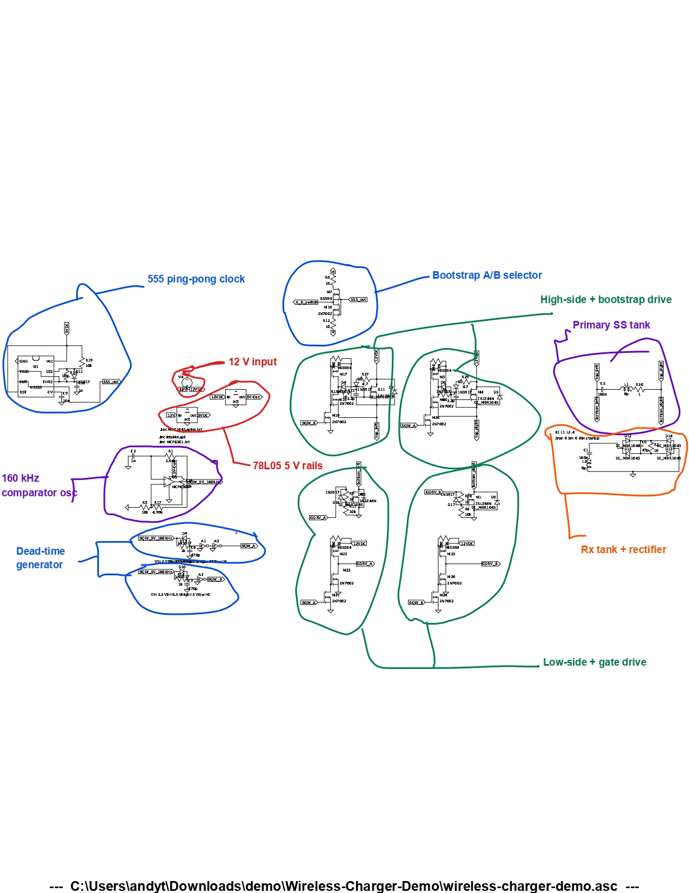

# Wireless-Charger-Demo

Quick demo of my wireless charger, for my Hack The North application. Simulated in LTspice, not built on a breadboard yet, but the circuit is complete and the waveforms below show it working.

## What it does

The circuit wirelessly transfers power from a transmitter coil to a receiver coil and outputs a regulated DC voltage on the other side.

On the transmitter side, an NE555 timer and a comparator generate a 160 kHz square wave. That square wave gets split into two complementary gate signals with a short deadtime between them, so the two switching MOSFETs never turn on at the same time and short out the supply. Those MOSFETs drive the primary coil (L1) in push-pull fashion, pushing current back and forth through it at 160 kHz.

The receiver coil (L2) sits close to the primary and picks up the oscillating magnetic field through mutual inductance. A diode bridge on the receiver side rectifies the AC induced in L2 back into DC, which charges up the output capacitor and appears across the load.

## Schematic

## Simulation results

**Oscillator output (160 kHz square wave, before deadtime and gate drivers):**

**Gate drive signals with deadtime between them:**

**Output voltage across the receiver:**

The output settles at around 15V. 

## License

LGPL v2.1, see LICENSE.
